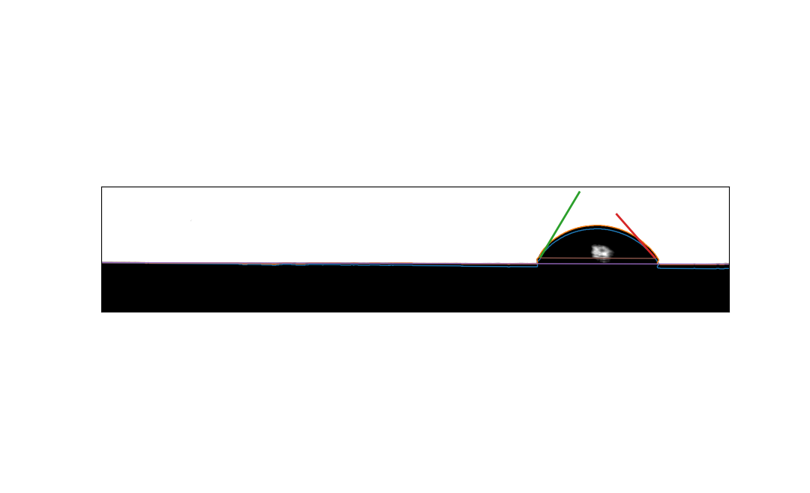
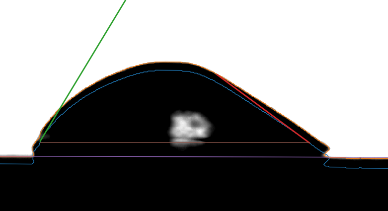

# Drop Shape Detection

## Introduction

A python script for drop shape analysis of single (stationary and moving) drops on level and tilted flat substrates with a reflection plane. It provides both contact angles, drop diameter and drop velocity. Results are determined by analyzing drop contours through polynomial and linear fits. \
This repository contains an early version of the script developed at the [Chair for Fluid Mechanics](https://www.lsm.uni-wuppertal.de/de/research/) at the [University of Wuppertal](https://www.uni-wuppertal.de/en/research/). It has been used in the following publication:
* Pub1
* Pub2

**Input**: 
* Single or series of images files (format must be supported by `imageio` python package, e.g. `.bmp`).
* File format of images
* Cameras shutter time in *seconds/frame* (irrelevant for stationary drops)

**Output**: A tab-separated file `<directory-name>.dat` is generated containing the following values
1. Filename
2. File number
3. Traveled distance of drop's left edge (in *pixels*)
4. Traveled distance of drop's right edge (in *pixels*)
5. Velocity of drop's left edge (in *pixels/second*)
6. Velocity of drop's right edge (in *pixels/second*)
7. Surface angle (in *degees*)
8. Drop width (in *pixels*)
9. Left contact angle (in *degrees*)
10. Right contact angle (in *degrees*)
11. Horizontal position of drop center (in *image coordinates*)
12. Vertical position of drop center (in *image coordinates*)
13. Drop Height (in *pixels*)

The repository contains an example case with results, which can be used for validation of correct execution.

## Usage
Before using the software, make sure you satisfy the requirements from `requirments.txt`. In particular, newer versions of the `numpy` library will lead to problems with nested arrays. The corresponding warning for `numpy 1.23.4` can be ignored, as it is only informing of depracation. It is suggested to use a virtual environment limited to the required packages.

### Data preparation
Data will be evaluated in alphanumerical order and should be provided in any format, which the `imageio` python package can transform to a greyscale image. However, only `.bmp` files have been tested. If a differnt image format is used, the value of `fileEnd` in the script needs to be adjusted accordingly. Lastly,`shutter_time` should be set to the right value, if an evaluation of drop velocity is desired.

### Execution
Simply run the script from the directory:
`user@desktop: <path-to-data>$ python <path-to-DSA.py>`

Depending on the amount of pictures the evaluation can take some time. In the case of 3000 pictures it can take several minutes. Once finished, results will be written into a file in the data directory. The name of the file is `<data-directory>.dat`.

### Detailed mode
The code performance can be analyzed by setting `debug = True`. This  prints intermediate values to the terminal as well as visualizes the shape analysis for the user. Naturally, this is not recommended when analyzing hundreds of pictures. Below is an example of such a visualization.

  
Green and red lines show how the contact angle was determined from the adjusted (i.e. rotated) contour line. The orignial contour line is shown in orange and should *always* overlap with the original contour. 

## License
This script is licensed under GPL 3.0. Please take a look at the citation file when using this software.
